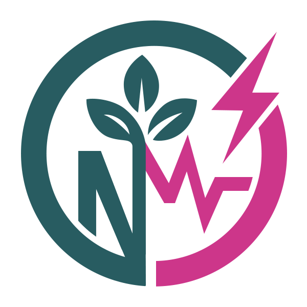
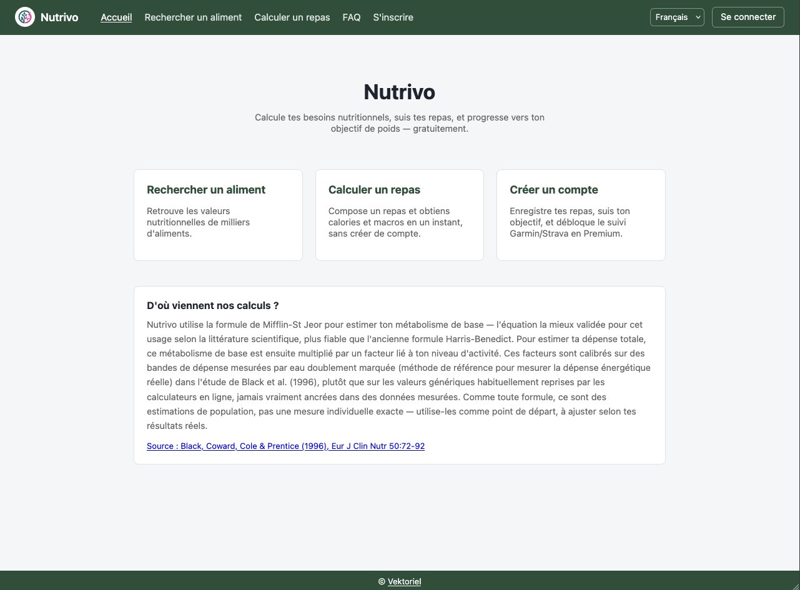
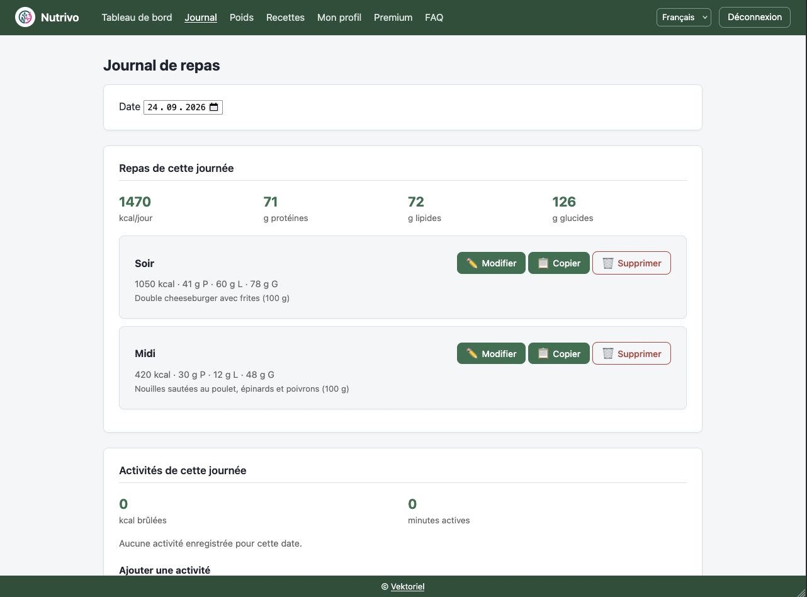

  

<h1 align="center">Nutrivo</h1>

Calcule tes besoins nutritionnels, suis tes repas et ton poids, et progresse vers ton objectif — gratuitement.

<a href="https://nutrivo.vektoriel.com"><strong>nutrivo.vektoriel.com →</strong></a>

## Captures d'écran

|---|---|
|  |  |

## Utiliser Nutrivo

- **[📖 Guide d'utilisation (wiki)](<URL_DU_DEPOT>/wiki)** — comment créer un compte, enregistrer un repas, suivre son poids, utiliser les fonctionnalités Premium (recettes, estimation par photo, synchronisation Garmin/Strava)...
- **[❓ FAQ](https://nutrivo.vektoriel.com/app/visiteur/faq.html)** — réponses courtes aux questions les plus fréquentes, directement dans l'application. Le wiki reste la référence pour le détail de chaque fonctionnalité.
- **[📱 Installer Nutrivo sur ton téléphone](<URL_DU_DEPOT>/wiki/Installer-Nutrivo-comme-une-application)** — comme une vraie application, sans passer par un store.

## Ce dépôt

Ce dépôt public sert de point d'entrée pour les utilisateurs de Nutrivo : guide d'utilisation, FAQ, et signalement de vulnérabilités. **Il ne contient pas le code source de l'application**, qui reste privé.

## Sécurité

Une faille de sécurité à signaler ? Voir [SECURITY.md](SECURITY.md) — merci de ne pas ouvrir d'issue publique pour ça.
